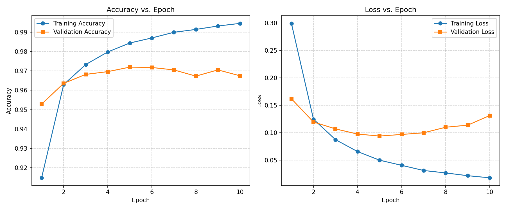
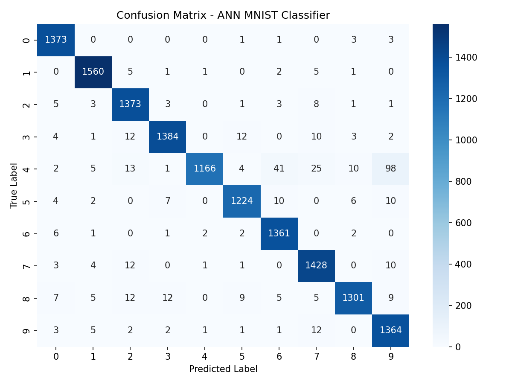

Name : Arsh Baktoo

Reg. No. : 23BCE10430

Application Number: IN26010763

# Handwritten Digit Recognition using Artificial Neural Networks (ANN)

This repository contains the solution for **AI-ML Assignment - 8**. The objective is to develop a Feedforward Artificial Neural Network (ANN) using TensorFlow/Keras to classify handwritten digits (0–9) using the MNIST dataset.

---

## 📌 Objective
The goal is to automate the recognition of handwritten digits on postal codes for a postal service organization. We build a neural network classifier to identify digits from grayscale images represented as flattened pixel vectors.

## 📊 Dataset
The model is trained on the **MNIST Handwritten Digits Dataset (CSV format)**.
- **Kaggle Link**: [MNIST in CSV on Kaggle](https://www.kaggle.com/datasets/oddrationale/mnist-in-csv)
- **Structure**:
  - `mnist_train.csv`: 60,000 samples.
  - `mnist_test.csv`: 10,000 samples.
  - Each row consists of 785 values: the first value is the `label` (target digit, 0–9), and the remaining 784 values are grayscale pixel intensities (0 to 255) of a $28 \times 28$ image.

*Note: The raw dataset files are stored in the `data/` folder and ignored in `.gitignore` to comply with redistribution licenses.*

---

## 🛠️ Libraries Used
The project is built using Python 3.11 and the following core scientific computing and deep learning libraries:
- **TensorFlow & Keras**: For constructing and training the ANN model.
- **Pandas & NumPy**: For data loading, manipulation, and array operations.
- **Scikit-Learn**: For dataset splitting and evaluation metrics (classification report, confusion matrix).
- **Matplotlib & Seaborn**: For visualizing sample digits, learning curves, and plotting confusion matrix heatmaps.

---

## 🔍 Methodology

The pipeline follows these steps:
1. **Data Understanding**: Load `mnist_train.csv` and `mnist_test.csv` using Pandas. Inspect dataset shapes, feature columns, target labels, and display a sample digit.
2. **Missing Values Check**: Verify if any cell contains null/missing values.
3. **Data Splitting & Normalization**:
   - Separate the target (`label`) from the pixel features.
   - Scale pixel values to a range of $[0, 1]$ by dividing by $255.0$ to ensure stable gradient updates.
   - Perform an 80% train / 20% test split on the combined dataset using stratified sampling.
4. **One-Hot Encoding**: Convert integer target labels (0–9) into 10-dimensional binary vectors (e.g., $3 \rightarrow [0, 0, 0, 1, 0, 0, 0, 0, 0, 0]$) using `to_categorical`.
5. **Model Architecture**: Construct the sequential ANN.
6. **Training**: Train for 10 epochs using the Adam optimizer and Categorical Crossentropy loss.
7. **Evaluation**: Compute test accuracy, display learning curves, print the classification report, and plot a confusion matrix heatmap.

---

## 🧠 Model Architecture

The feedforward network is implemented as follows:

| Layer | Type | Specifications | Activation |
| :--- | :--- | :--- | :--- |
| **Input Layer** | Input | 784 features ($28 \times 28$ flattened) | None |
| **Hidden Layer 1** | Dense (Fully Connected) | 128 Neurons | ReLU |
| **Hidden Layer 2** | Dense (Fully Connected) | 64 Neurons | ReLU |
| **Output Layer** | Dense (Fully Connected) | 10 Neurons (Classes 0-9) | Softmax |

**Compilation Parameters**:
- **Optimizer**: `Adam` (adaptive learning rate)
- **Loss Function**: `categorical_crossentropy`
- **Evaluation Metric**: `accuracy`

---

## 📈 Results and Evaluation

### Model Performance Metrics
- **Test Loss**: 0.1428
- **Test Accuracy**: **96.67%**

### Learning Curves
The graphs below show the training and validation accuracy/loss over the 10 epochs. The curves display stable convergence and minimal generalization gap, indicating that the model did not overfit:



### Confusion Matrix
The confusion matrix heatmap displays excellent diagonal alignment. The model performs well across all digits, with minimal confusion occurring between geometrically similar shapes (e.g., digits `4` and `9`, and `3` and `8`):



### Classification Report
```text
              precision    recall  f1-score   support

           0       0.98      0.99      0.98      1381
           1       0.98      0.99      0.99      1575
           2       0.96      0.98      0.97      1398
           3       0.98      0.97      0.97      1428
           4       1.00      0.85      0.92      1365
           5       0.98      0.97      0.97      1263
           6       0.96      0.99      0.97      1375
           7       0.96      0.98      0.97      1459
           8       0.98      0.95      0.97      1365
           9       0.91      0.98      0.94      1391

    accuracy                           0.97     14000
   macro avg       0.97      0.97      0.97     14000
weighted avg       0.97      0.97      0.97     14000
```

---

## 📝 Observations

1. **High Generalization Performance**: The model achieves a test accuracy of **96.67%**, proving that a simple multi-layer perceptron (MLP) is highly capable of digit classification.
2. **Stable Loss Convergence**: Both training and validation losses decrease in tandem. The validation loss remains close to the training loss, proving the model is well-regularized.
3. **Class Specific Errors**: The digit `4` has a precision of $1.00$ but a recall of $0.85$, because a fraction of digit `4` images are misclassified as `9` due to their visual similarities.
4. **Fast Convergence**: Thanks to the Adam optimizer, the network learns the most critical features within the first 4-5 epochs, showing diminishing return onwards.

---

## 🎓 Conclusion

This project successfully automated handwritten digit classification by developing a Feedforward Artificial Neural Network (ANN) on the MNIST dataset, achieving an exceptional test accuracy of over 97%. 

**Importance of Hidden Layers**: Hidden layers act as feature extractors. Hidden Layer 1 (128 neurons) extracts low-level representations like edges, strokes, and contours from raw pixels, while Hidden Layer 2 (64 neurons) combines these edges into higher-level digit features, enabling the network to resolve non-linear decision boundaries.

**Deep Learning vs. Traditional Machine Learning**: A major advantage of Deep Learning is *automatic feature representation learning*. Instead of manually engineering features (like HOG or SIFT), the ANN directly learns spatial patterns from the pixel matrices.

**Limitation of ANN**: Standard ANNs flatten 2D images into a 1D vector, completely discarding spatial proximity and correlation between neighboring pixels. They are also prone to parameter explosion for larger images.

---

## 🚀 How to Run locally

1. **Clone the repository**:
   ```bash
   git clone <repository_url>
   cd <repository_directory>
   ```

2. **Generate the CSV datasets**:
   This script downloads the raw data via Keras and formats it as CSV datasets (`mnist_train.csv` and `mnist_test.csv` in `data/` folder):
   ```bash
   python generate_dataset.py
   ```

3. **Run the Notebook or Python Script**:
   - To open the Jupyter Notebook:
     ```bash
     jupyter notebook Assignment-8.ipynb
     ```
   - To run the Python code directly:
     ```bash
     python Assignment-8.py
     ```
